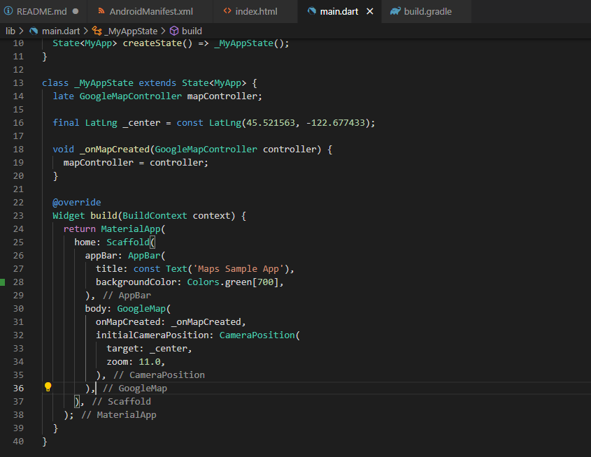

# google_maps_in_flutter

A new Flutter project.

## Mulai menggunakan Flutter

Cara termudah untuk mulai menggunakan Flutter adalah dengan memanfaatkan alat command line flutter untuk membuat semua kode yang diperlukan untuk pengalaman penggunaan awal yang sederhana.
````
$ flutter create google_maps_in_flutter
Creating project google_maps_in_flutter...
[Listing of created files elided]
Wrote 127 files.

All done!
In order to run your application, type:

  $ cd google_maps_in_flutter
  $ flutter run

Your application code is in google_maps_in_flutter/lib/main.dart.
````

## Menambahkan plugin Google Maps Flutter sebagai dependensi

Menambahkan kemampuan tambahan ke aplikasi Flutter mudah dilakukan menggunakan paket Pub. Dalam codelab ini, Anda akan menerapkan plugin Google Maps Flutter dengan menjalankan perintah berikut dari direktori project.


Codelab ini juga akan membahas cara menggunakan Google Maps di Flutter untuk Web. Namun, versi Web plugin ini belum difederasi, jadi Anda juga perlu menambahkannya ke project.


## Mengonfigurasi minSDK Android

Untuk menggunakan Google Maps SDK di Android, tetapkan minSDK ke 20. Ubah android/app/build.gradle sebagai berikut.


# Menambahkan Google Maps ke aplikasi

## Tentang kunci API

Untuk menjalankan Google Maps di aplikasi Flutter, Anda perlu mengonfigurasi project API menggunakan Google Maps Platform, dengan mengikuti petunjuk dalam artikel Menggunakan kunci API (Maps SDK for Android), Menggunakan kunci API (Maps SDK untuk iOS), dan Menggunakan kunci API (Maps JavaScript API). Setelah memiliki kunci API, lakukan langkah-langkah berikut untuk mengonfigurasi aplikasi Android dan iOS.


## Menambahkan kunci API untuk aplikasi Web

Untuk menambahkan kunci API ke aplikasi Web, edit file index.html di web. Tambahkan referensi ke skrip Maps JavaScript di bagian head, dengan kunci API Anda.


## Menampilkan peta di layar

Sekarang saatnya menampilkan peta di layar. Update lib/main.dart sebagai berikut:



## Menjalankan aplikasi

Jalankan aplikasi Flutter di iOS atau Android untuk melihat satu tampilan peta, yang berpusat di Portland. Atau, jalankan Android Emulator atau simulator iOS. Jika ingin, ubah pusat peta untuk menampilkan kota asal Anda, atau tempat mana pun yang penting bagi Anda.


# Menempatkan Google di Peta

Google memiliki banyak kantor di seluruh dunia, mulai dari Amerika Utara, Amerika Latin, Eropa, Asia Pasifik, hingga Afrika & Timur Tengah. Jika Anda mempelajarinya, peta ini memiliki fungsi yang praktis, yaitu endpoint API yang mudah digunakan untuk menyediakan informasi lokasi kantor dalam format JSON. Pada langkah ini, Anda akan menempatkan lokasi kantor tersebut di peta. Pada langkah ini, Anda akan menggunakan pembuatan kode untuk menguraikan JSON.

Tambahkan tiga dependensi Flutter baru ke project sebagai berikut. Pertama, tambahkan paket http untuk membuat permintaan HTTP dengan mudah.


Selanjutnya, tambahkan json_serializable untuk mendeklarasikan struktur objek agar merepresentasikan dokumen JSON.


Terakhir, tambahkan build_runner sebagai dependensi waktu pengembangan. Hal ini akan digunakan untuk pembuatan kode nanti di langkah ini.


## Menguraikan JSON dengan pembuatan kode

Anda mungkin mendapati bahwa data JSON yang ditampilkan dari endpoint API memiliki struktur biasa. Akan lebih praktis jika Anda membuat kode untuk mengarahkan data tersebut ke objek yang dapat digunakan dalam kode.

Dalam direktori lib/src, buat file locations.dart dan deskripsikan struktur data JSON yang ditampilkan sebagai berikut:


Setelah menambahkan kode ini, IDE (jika Anda menggunakannya) akan menampilkan beberapa garis bergelombang merah, karena IDE ini merujuk ke file seinduk yang tidak ada, locations.g.dart. File yang dihasilkan ini dikonversi antara struktur JSON tidak bertipe dan objek bernama. Buat file tersebut dengan menjalankan build_runner:


Sekarang, kode Anda seharusnya dianalisis kembali dengan rapi. Selanjutnya, kita harus menambahkan file fallback locations.json yang digunakan dalam fungsi getGoogleOffices. Salah satu alasan menyertakan fallback ini adalah karena data statis yang dimuat dalam fungsi ini disajikan tanpa header CORS, sehingga akan gagal dimuat di browser web. Aplikasi Flutter versi Android dan iOS tidak memerlukan header CORS, tetapi akses data seluler dapat bermasalah bahkan dalam kondisi yang menguntungkan.

Buka <https://about.google/static/data/locations.json> di browser Anda, lalu simpan kontennya ke dalam direktori aset. Atau, Anda dapat menggunakan command line sebagai berikut.


Setelah file aset didownload, tambahkan file tersebut ke bagian flutter di file pubspec.yaml Anda.


Ubah file main.dart untuk meminta data peta, lalu gunakan info yang ditampilkan untuk menambahkan kantor ke peta:

